# Project - college time table
## 😵 Problem Statement
In online mode of studies lecture links are like class rooms. Ofcourse in we wont forget way to our class room. But we cant even remember all the lecture links right.

It is difficult to find the right lecture link at the right time.

## 💡 Solution
To overcome the problem I initially made a pdf of all the lecture links but it lacked the time table feature.

So I made a chome extension which will automatically show the time table of that day and the lecture links.

## 🧐 Sneak Peek

     
    Monday View 
    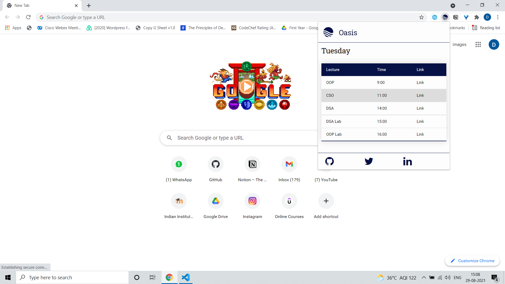 
    Tuesday View 
    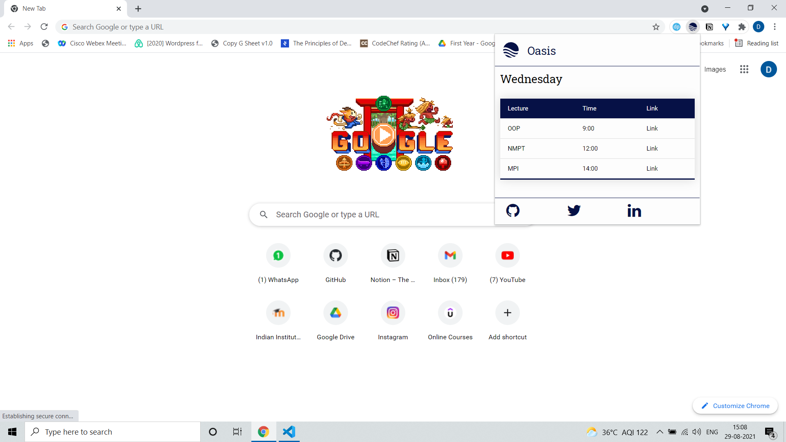 
    Wednesday View 
    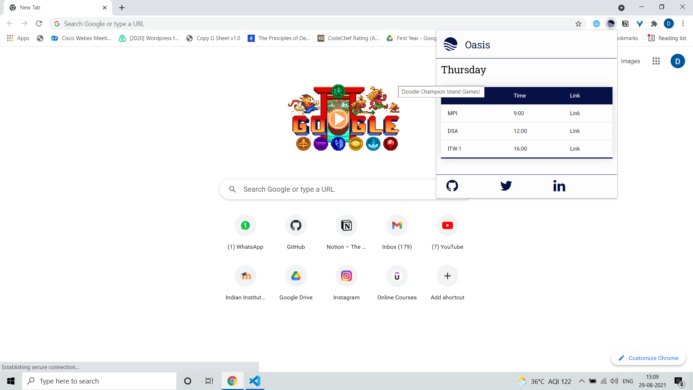 
    Thrusday View 
    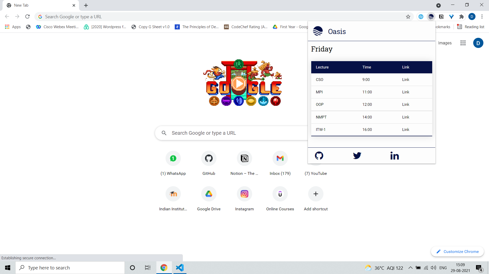 
    Friday View 
    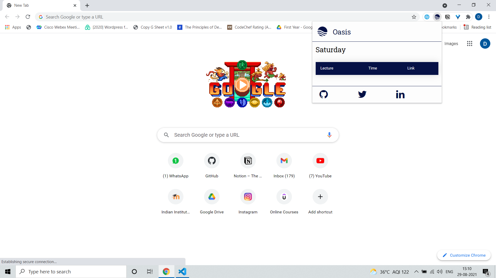 
    Saturday View 
    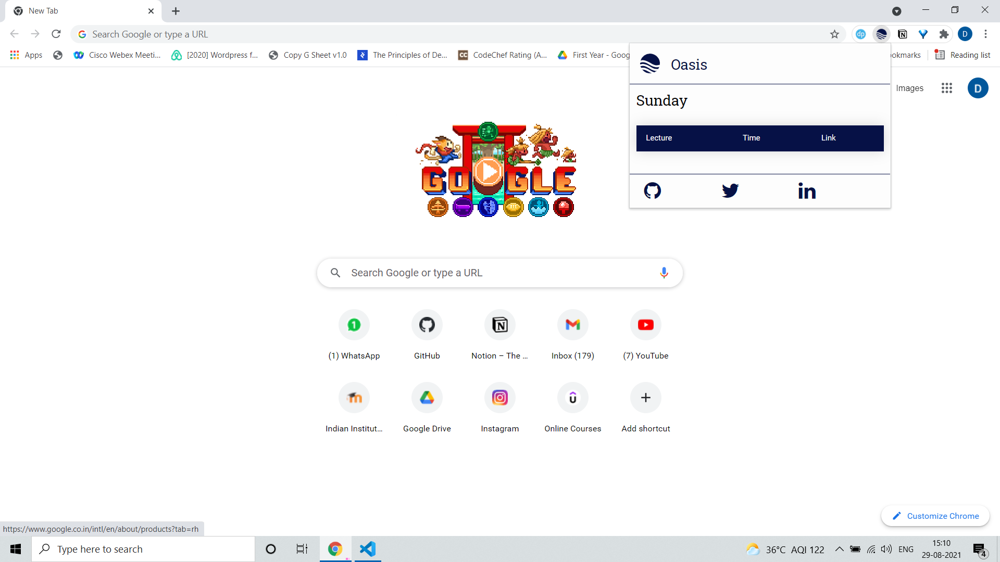 
    Sunday View 

## 🤓 How to Download and Install

Download the extension from <a href="https://github.com/deeppanchani/deeppanchani_extension/blob/main/deeppanchani%20links.zip" target="_blank">here</a>.

### Setps to Install

1. Unzip the folder.
2. Save it in a save location. If this folder gets deleted your extension will also get deleted.
3. Open Chrome. Got to menu option.
4. Find "More Tools" option. In that you will find an option names "Extensions".

    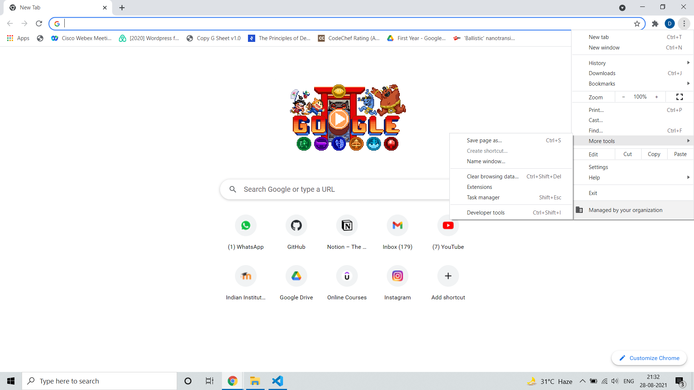

5. On Opening the Extensions. You will find the following screen.
    
    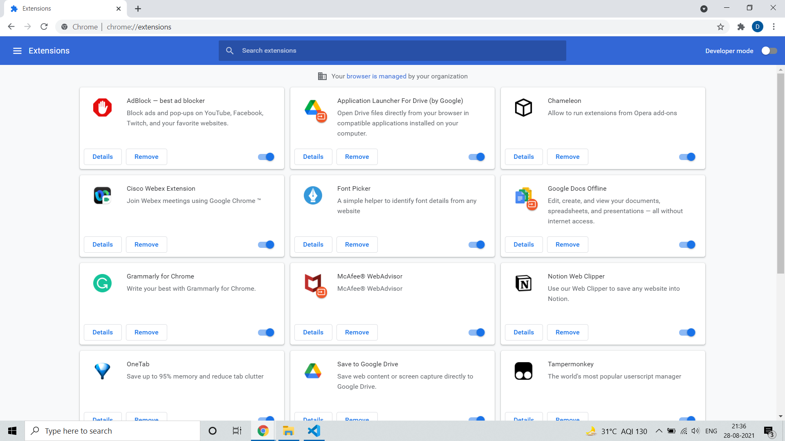

6. Turn On the Developer Mode.
    
    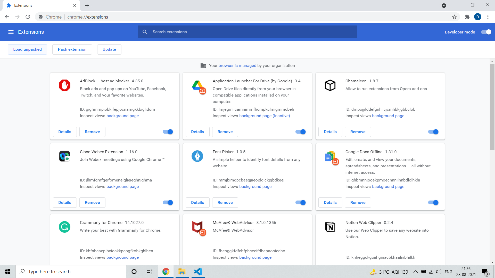

7. Select "Load unpacked".
8. Select the unziped files.
    
    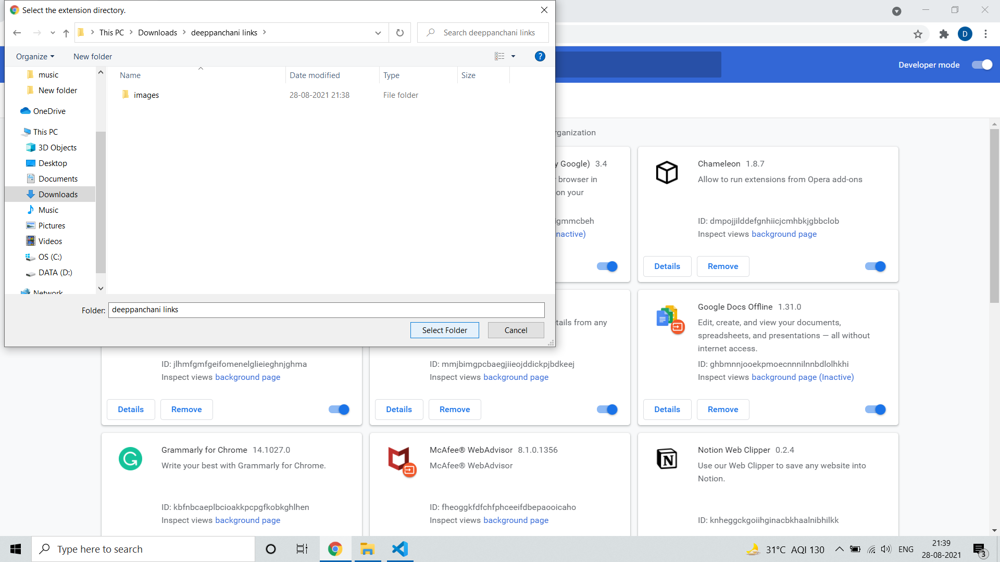
9. Done. You are ready to use the extension.
    
    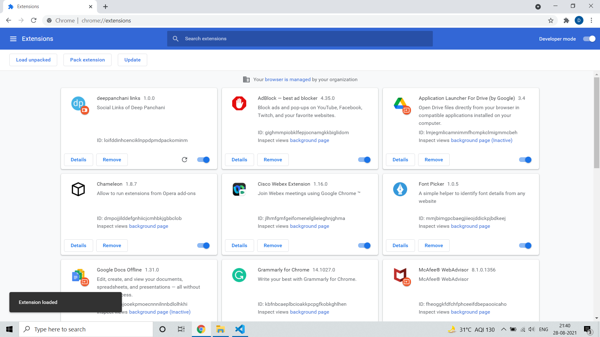

## 🧰 Built With

    
    
    
    &nbsp;
    &nbsp;
    

## 🙋‍♂️ About Me

Hey I am Deep Panchani. Computer Science and Engineering student from Indian Institute of Information Technology, Nagpur. 

### Connect with me over:
[LinkedIn](https://www.linkedin.com/in/deep-panchani-7805861b5/)
[Twitter](https://twitter.com/deeppanchani21)
[GitHub](https://github.com/deeppanchani)
[Instagram](https://www.instagram.com/deepanchani/)